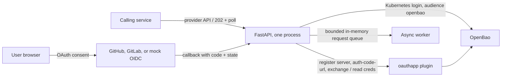

# Design

## Architecture

FastAPI validates requests and coordinates the flow. The OpenBao `oauthapp` plugin constructs authorization URLs, exchanges codes, stores credentials, and refreshes tokens. The service never implements OAuth token exchange or refresh itself. Terraform configures the plugin, mount, Kubernetes auth role, and policy. The handwritten Helm chart supplies the service account, projected token, probes, and restricted container settings.

## Data placement

| Data | Location | Reason |
|---|---|---|
| OAuth client secrets, access/refresh tokens | OpenBao plugin storage | The secrets system owns secret persistence and token refresh. |
| Provider metadata, one-use OAuth state, queued request status/results | Service memory | No database or disk persistence is required by this single-replica take-home. |
| OpenBao dev root token | Ignored local `.secrets/` file and Kubernetes bootstrap Secret | Local bootstrap only; never returned to the service or logged. |
| Terraform state | Kubernetes Secret in the `openbao` namespace | Cluster-scoped local state disappears with the dev cluster. |

The service runs with a read-only root filesystem and no persistent volume. Provider client secrets are passed to OpenBao over its API and are not included in provider responses or logs. An access token is returned only by a successful `GET /requests/{id}` result.

## Request flows

1. **Register:** `POST /providers` writes `oauthapp/servers/{name}`. The provider registry keeps only the non-secret name, type, and scopes in memory.
2. **Consent:** connect creates a random, expiring, one-use state and calls the plugin's `auth-code-url` endpoint. The callback atomically consumes state and passes the code to `oauthapp/creds/{provider}_{user}`. The plugin v3 path is `auth-code-url`; older README examples that say `config/auth-code-url` are outdated.
3. **Retrieve:** `GET /{provider}/{user}` enqueues bounded work and returns `202` with a request location. One worker reads the current credential from OpenBao; the plugin refreshes it if needed. The caller polls until the request succeeds or fails. Results expire from memory.

The queue is bounded. If it is full, the API answers `503` rather than claiming it accepted work it cannot retain. Each request has one queue consumer and a guarded state transition; accepted work is not fulfilled twice. Graceful shutdown stops intake and drains the queue within the configured grace period.

## Replica and process limits

Run one replica and one Uvicorn process. With two replicas, OAuth state created on pod A may reach pod B at callback time; polling a request ID on the other pod may return 404; and provider registries can diverge. A second Uvicorn worker creates the same split inside one pod because each worker has separate memory. To scale, move provider metadata, one-use state, and request state/queue to shared storage, use a durable queue with idempotency keys, and route callbacks independently of pod affinity. A cache alone does not provide durable, exactly-once work.

## Security and operations

The pod receives a projected ServiceAccount token with audience `openbao` and a short expiry. OpenBao validates it through Kubernetes TokenReview; Terraform binds the role to one ServiceAccount and namespace, gives it a 15-minute token TTL (one-hour maximum), and disables the default policy. The policy grants only provider server registration/list, authorization URL generation, and credential create/update/read operations.

Readiness checks whether the app can serve requests and reach OpenBao; liveness checks only the local process so a temporary OpenBao outage does not cause restart loops. Startup and readiness probes give dependencies time to become available. `Recreate` avoids two active singleton processes during upgrades. Resource requests and limits constrain scheduling and memory use. NetworkPolicy support is optional because enforcement depends on the selected CNI.

Local OpenBao uses dev mode: data is in memory, it auto-unseals, has no TLS, and its root token is deliberately available for bootstrap. Do not use these settings in production. Production would use durable Raft storage, TLS, controlled unseal or auto-unseal, audit devices, backups, and managed identities. CI publishes the image and chart, then deploys those exact artifacts to minikube and exercises OAuth, leak, idempotency, and performance paths.

## Second provider and production changes

The registry supports GitHub and GitLab; provider specifics remain in OpenBao's plugin configuration. Local end-to-end tests use a mock OIDC issuer and do not require real OAuth credentials. The GitHub demo uses the same API with a local callback and reads its app credentials from ignored `.env`.
