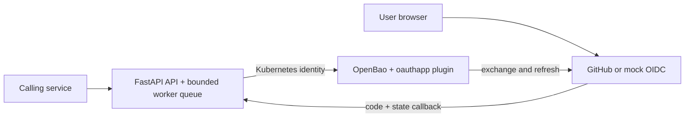

# Design

## Responsibilities and data

| Owner | Data and work |
|---|---|
| FastAPI service | Provider names/types/scopes, one-use expiring OAuth state, asynchronous request status and results, and a bounded non-secret activity feed, all in memory. It coordinates consent and returns `202` for token requests. |
| OpenBao `oauthapp` plugin | Client secrets, access/refresh tokens, authorization URL generation, code exchange, and token refresh. The service does not implement its own refresh or token cache. |
| Kubernetes / Terraform | Helm deploys the service and OpenBao. Terraform registers/enables the plugin, configures Kubernetes authentication, and applies a policy limited to required plugin paths. Terraform state is a Kubernetes Secret in the local cluster. |

1. **Register:** `POST /providers` writes a server configuration to OpenBao. Responses return metadata but no client secret.
2. **Connect:** the service generates random state, asks the plugin for an authorization URL, and remembers the state briefly. The user's browser visits the provider. `/callback` consumes the state once and gives the code to the plugin for exchange. A stale or reused callback fails.
3. **Retrieve:** `GET /{provider}/{user}` queues work and returns `202` plus `Location: /requests/{id}`. A worker reads credentials from the plugin, which refreshes if needed. Polling the location returns status, then the token only on success. The local dashboard polls `/requests/{id}/status` for the same progress without receiving a token. Bounded queues and state stores reject overload instead of losing accepted work.

## Deployment and limits

The dashboard at `/` calls the same API as other clients. It displays the last 80 event summaries from `/activity` and keeps a short request trace in browser session storage. Event summaries contain only the first eight characters of request IDs, so they cannot be used to fetch a token result. Neither view contains secrets, codes, OAuth state, or tokens. The activity feed resets when the process restarts and is intended for the local demonstration rather than a durable audit trail. Browser callbacks redirect to the dashboard after a successful code exchange; callers requesting JSON keep the original callback response.

The chart requires one replica; the image runs one Uvicorn process. OAuth state and request IDs are local to that process. With two copies, a callback or poll could reach the wrong copy and fail. Scaling requires shared provider/state/request storage, a durable queue, and idempotent processing. In-flight work and memory-only state are lost when this process restarts.

The pod uses a projected, short-lived ServiceAccount token for OpenBao Kubernetes auth; Terraform binds the role to this account and namespace with a restricted policy. The app runs with a read-only root filesystem and resource limits. Readiness tests OpenBao reachability; liveness tests the app process. The `Recreate` strategy avoids simultaneous singleton pods during upgrades.

Local OpenBao runs in development mode: storage is memory-only, it auto-unseals, and TLS is absent. A restart loses its data. `make up` restores declared configuration; test or real consent must be repeated. Production needs durable encrypted storage, TLS, controlled unseal, backups, and audit logs. The local API also needs caller authentication and authorization before production use; a user ID alone must never grant token access.

The second end-to-end provider in the automated tests is a local mock OIDC issuer, as the assignment permits. GitLab registration is supported but a real GitLab consent flow has not been demonstrated. The [real GitHub transcript](docs/demo/github-flow.md) proves human consent and token use against GitHub. The [performance report](perf/REPORT.md) describes the measured workload and limits.
